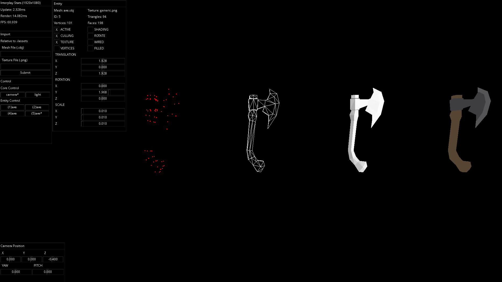

3D renderer written from scratch in C. **Purely** for educational purposes, as I want to better understand the
beautiful mathematics behind it all.

---

#### Compilation

(*TODO: instead of having platform specific SDLs, which seems incredibly stupid, make a download script*)

Regardless of platform, ensure you have [cmake](https://cmake.org/).

You also have to run these two commands:

`git submodule init`

`git submodule update`

Then either setup `SDL`, `SDL_image` and `SDL_tff` using your own preferred method, or follow below instructions.

##### Windows

Install [Ninja](https://github.com/ninja-build/ninja/releases) and [clang](https://clang.llvm.org/), then run:

-   `.\generate-windows.bat`
-   `.\build-windows.bat`
-   `.\build\bin\interplay.exe`

##### MacOS

-   `cmake .`
-   `make`
-   `./bin/interplay`

---

#### Acknowledgements

I've used two primary resources, and I want to extend gratitude to the people behind those resources:

-   [Gustavo Pezzi](https://twitter.com/pikuma)

Gustavo's course [3D Computer Graphics Programming](https://pikuma.com/courses/learn-3d-computer-graphics-programming) has been my main resources to get an introductory understanding of 3D maths.
Gustavo is a phenomenal teacher with a great focus on mathematics. His clarity and thoroughness is something I value a great deal.
Besides, he also has a [YouTube channel](https://www.youtube.com/@pikuma) with loads of free awesome content.

-   [Fletcher Dunn](https://twitter.com/ZPostFacto)

The book [3D Math Primer for Graphics and Game Development](https://gamemath.com/book/intro.html)
contains excellent explanations (with problems) and has been an enjoyable read. It's even free! Thank you, Fletcher Dunn.
